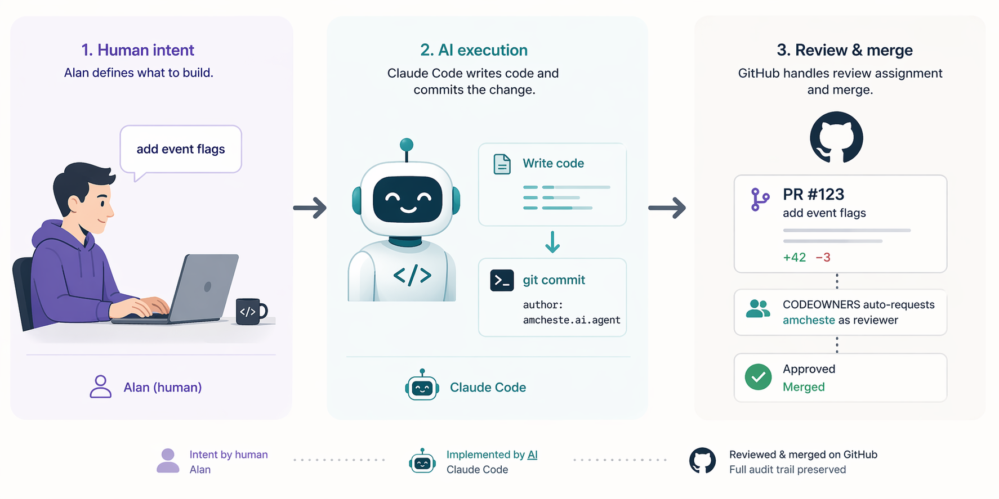

# Design: Claude Bot Account for AI-Authored PRs

**Status:** Design Approved — Pending Implementation
**Author:** Alan Chester
**Date:** 2026-04-22 (revised 2026-04-23)

---



## Problem

Claude Code writes the lion's share of the code in my projects. Alan reviews and approves it. But because Claude pushes using Alan's GitHub credentials, every PR shows Alan as both the **author** and the only possible **reviewer** — and GitHub blocks self-review. Beyond the mechanical issue of not being able to request review in Graphite, Linear, or GitHub, this collapses three distinct properties of a healthy code-review workflow:

- **Auditability** — the record doesn't distinguish what Alan wrote from what Claude wrote. From the git log and PR list, every line of code looks like Alan's.
- **Traceability** — there's no durable signal separating "AI-generated code that was reviewed" from "human-authored code." Months later, when investigating a regression, that distinction is load-bearing.
- **Accountability** — "AI wrote, human approved" is the contract. Without a visible separation, the contract is invisible. An external reviewer has no way to verify the contract was followed.

This design fixes all three by splitting authorship from review at the account level.

## Goal

Separate authorship from review so that:

1. PRs are **authored** by a dedicated bot account (`amcheste.ai.agent`)
2. Alan is **auto-requested as reviewer** via CODEOWNERS
3. The audit trail is clean: AI wrote it, human reviewed it, and both facts are visible
4. The day-to-day workflow doesn't change (Alan talks to Claude, Claude ships code)

## Ownership Model

The core question: **who owns the commit and the PR?** This depends on who is driving the work, not who touches the keyboard.

### Scenarios

#### Scenario 1: Claude-driven coding session

> Alan launches Claude Code and describes what he wants. Claude writes the code, commits, and raises the PR. Alan reviews in Graphite.

| | |
|---|---|
| **Driver** | Claude Code |
| **Alan's role** | Guidance, direction, review |
| **Commit author** | `amcheste.ai.agent` |
| **PR author** | `amcheste.ai.agent` |
| **Reviewer** | `amcheste` (auto-requested via CODEOWNERS) |

#### Scenario 2: Claude-driven with human steering in Cursor

> Alan has Claude open a file in Cursor via the side panel. Alan reads the code to give better guidance, or edits the file directly to show Claude what he means. Claude is still driving the overall task — Alan's edits are guidance, not primary authorship.

| | |
|---|---|
| **Driver** | Claude Code |
| **Alan's role** | Guidance via review and direct edits |
| **Commit author** | `amcheste.ai.agent` (Claude does the commit) |
| **PR author** | `amcheste.ai.agent` |
| **Reviewer** | `amcheste` |

> **Key principle:** Even when Alan touches the code, if Claude is the one orchestrating the work and doing the `git commit`, it's a Claude-owned deliverable. Alan's edits are steering, not authorship.

#### Scenario 3: Automated from Linear ticket

> A Linear ticket is auto-assigned to Claude (via scheduled task or webhook). Claude picks it up, writes the code, commits, and raises the PR — all without Alan initiating a session.

| | |
|---|---|
| **Driver** | Claude Code (autonomous) |
| **Alan's role** | Review only |
| **Commit author** | `amcheste.ai.agent` |
| **PR author** | `amcheste.ai.agent` |
| **Reviewer** | `amcheste` |

#### Scenario 4: Human-driven coding

> Alan opens a terminal or Cursor and writes code himself. He may ask Claude for guidance (explain a function, suggest an approach, review a snippet) but Alan is driving — he's on the keyboard, he decides what to commit, he runs `git commit`.

| | |
|---|---|
| **Driver** | Alan |
| **Claude's role** | Guidance, rubber duck, Q&A |
| **Commit author** | `amcheste` (Alan's default git config) |
| **PR author** | `amcheste` |
| **Reviewer** | N/A (self-authored, or request a peer) |

### The Rule

> **Whoever runs `git commit` determines the author.**
>
> - Claude Code always uses `--author="amcheste.ai.agent <...>"` (per CLAUDE.md)
> - Alan's terminal and Cursor use his default git config (`amcheste`)
>
> No manual switching required. The tools enforce the boundary.

The beauty of this model is the enforcement mechanism is dead simple. Claude Code always adds `--author`, your terminal and Cursor don't. There is no config switching, no remembering which mode you're in. You sit down, you code, your commits are yours. You talk to Claude, Claude codes, Claude's commits are the bot's. Even in the same repo, on the same branch, five minutes apart.

### Edge Case: Scenario 2 Boundary

Scenario 2 has one subtle edge case worth calling out. If Alan edits a file in Cursor and then *Alan* runs `git commit` from Cursor's terminal (not Claude Code), the commit will be under `amcheste` — because Alan's git config is the default. But per the intent of Scenario 2, if Claude is driving the overall task, Claude should be the one committing.

The rule of thumb: **if Claude is driving, let Claude commit.** Don't commit from Cursor's terminal while Claude is orchestrating the work. If you make edits to steer Claude in the right direction, save the file and let Claude pick up the changes and do the commit. This keeps the ownership model clean without any tooling gymnastics.

### Summary Table

| Scenario | Who drives | Who commits | Commit author | PR author | Reviewer |
|---|---|---|---|---|---|
| 1. Claude session | Claude | Claude | `amcheste.ai.agent` | `amcheste.ai.agent` | `amcheste` |
| 2. Claude + Cursor steering | Claude | Claude | `amcheste.ai.agent` | `amcheste.ai.agent` | `amcheste` |
| 3. Linear ticket (automated) | Claude | Claude | `amcheste.ai.agent` | `amcheste.ai.agent` | `amcheste` |
| 4. Alan coding | Alan | Alan | `amcheste` | `amcheste` | --- |

## Proposed Architecture

```
 Alan (human)                    Claude Code                     GitHub
 ───────────                    ───────────                     ──────
 "add event flags"  ──────►  writes code locally
                              commits as amcheste.ai.agent ──►  pushes branch
                              gh pr create (bot auth)      ──►  opens PR
                                                                │
                              CODEOWNERS: * @amcheste     ──►  auto-requests
                                                                Alan as reviewer
                                                                │
 reviews in Graphite  ◄─────────────────────────────────────   PR visible in
 approves / merges                                             review queue
```

> 📣 **Rendering note:** this ASCII diagram is the canonical reference. A rendered version (DALL-E or similar) is planned — see the issue tracking this doc for the image asset.

## Components

### 1. Bot GitHub Account

| Field | Value |
|---|---|
| Username | `amcheste.ai.agent` |
| Login email | `amcheste.ai.agent@gmail.com` |
| Commit email | GitHub's noreply form for this account (visible under *Settings → Emails → "Keep my email addresses private"*) — typically `<ID>+amcheste.ai.agent@users.noreply.github.com` for modern accounts |
| Role | Installed via GitHub App on target repos (see §2) |
| Avatar | Something that makes it obvious it's a bot (e.g. a generated avatar, a distinct colored square) |
| Bio | "Bot account for AI-authored PRs. Code written by Claude, reviewed by @amcheste." |

**Setup steps:**
1. ✅ Create the GitHub account (`amcheste.ai.agent@gmail.com` — done).
2. Add the clear bio above and a distinguishing avatar.
3. Record the account's noreply commit email from *Settings → Emails*.

### 2. GitHub App (not a PAT)

A GitHub App is the right auth surface for this — not a personal access token. The reasons:

- **No token rotation.** The App issues short-lived installation tokens automatically.
- **Better audit logs.** App actions show up as `<app-name>[bot]` in the GitHub UI, so logs make the human-vs-bot distinction visible for free.
- **Scoped installation.** Install on specific repos (or all owned repos) without granting account-wide access.
- **Rate limits.** App installations get their own bucket — won't contend with Alan's personal API usage.
- **Showcases engineering rigor.** This is the "right way" pattern; worth the one-time setup cost.

**Setup steps:**
1. Log into the `amcheste.ai.agent` account.
2. **Settings → Developer settings → GitHub Apps → New GitHub App**.
3. App name: `amcheste-ai-agent` (or similar — must be globally unique on GitHub).
4. Homepage URL: point at the engineering-handbook repo.
5. Webhook: disabled (we don't need event webhooks for this workflow).
6. Repository permissions:

   | Permission | Access | Why |
   |---|---|---|
   | Contents | Read & Write | Push branches |
   | Pull requests | Read & Write | Create/edit PRs |
   | Metadata | Read (mandatory) | Required by GitHub |

7. Account permissions: none needed.
8. "Where can this GitHub App be installed?" → **Only on this account**.
9. Create the App, generate a **private key** (`.pem`), download and store it in **Apple Passwords** (secure note attachment) as `amcheste-ai-agent GitHub App private key`.
10. Install the App on the target account and select repos — start with "All repositories" (see §Scope below).

**Token flow at runtime:**

The App issues short-lived installation tokens (1 hour TTL). Claude Code doesn't hold a long-lived secret; it mints a token per session using the App ID + private key:

```bash
# In ~/.claude/hooks or wherever Claude's env is seeded
export CLAUDE_GH_APP_ID="<app_id>"
export CLAUDE_GH_APP_PRIVATE_KEY_PATH="$HOME/.claude/secrets/amcheste-ai-agent.pem"
```

Then a small helper (or `gh api` extension) converts App ID + private key → installation token → `GH_TOKEN` env for the session. The [github/actions-token](https://github.com/actions/create-github-app-token) action does this in CI; for local sessions, the `gh auth` workflow via App credentials, or a 20-line helper script signing a JWT and exchanging for an installation token, works fine.

### 3. Local Git Configuration (`--author` flag)

Claude Code overrides the author at commit time using git flags, without touching the repo's git config at all:

```bash
git commit --author="amcheste.ai.agent <amcheste.ai.agent@users.noreply.github.com>" -m "..."
```

Alan's global git config (`amcheste` / `amcheste@gmail.com`) stays untouched. When Alan codes in Cursor or the terminal, commits are his. When Claude Code commits, it uses the `--author` flag per CLAUDE.md.

> **Why this wins:** Zero repo setup, zero risk of Alan's commits appearing as the bot, works everywhere immediately. The only requirement is the CLAUDE.md instruction.

CLAUDE.md instruction:

```markdown
# In ~/.claude/CLAUDE.md
- When committing, always use:
  git commit --author="amcheste.ai.agent <amcheste.ai.agent@users.noreply.github.com>"
```

This gives clean separation:
- **Alan commits in Cursor/terminal** → `amcheste` (his normal identity)
- **Claude Code commits** → `amcheste.ai.agent` (bot identity)
- **Both** → same repo, same branch, no config switching

### 4. `gh` CLI Auth for Bot Sessions

Claude Code sessions authenticate as the GitHub App installation using a short-lived token, not a static PAT:

```bash
# At session start, Claude Code mints an installation token from the App
export GH_TOKEN=$(generate-app-installation-token \
  --app-id "$CLAUDE_GH_APP_ID" \
  --private-key "$CLAUDE_GH_APP_PRIVATE_KEY_PATH")

# Then uses it for the duration of the session
gh pr create ...
```

Alan's default `gh auth` stays his. The App token lives in the session's environment, expires in an hour, and never gets written to disk as a permanent credential.

### 5. CODEOWNERS

```
# .github/CODEOWNERS
* @amcheste
```

Since the PR author is now `amcheste.ai.agent` (not `amcheste`), GitHub will **auto-request `amcheste` as reviewer**. This is the key unlock — the review-request mechanism works normally, no workarounds required.

### 6. Branch Protection

```
Settings → Branches → main:
  [x] Require pull request before merging
  [x] Require approvals: 1
  [x] Require review from CODEOWNERS
  [ ] Include administrators  (leave unchecked so Alan can emergency-merge)
```

This enforces that no code reaches `main` without Alan's explicit approval.

### 7. Retire the Assignee Workaround

This design **deprecates** the current auto-assignee hack.

Background: because self-review was blocked when Alan was both author and reviewer, the current auto-assign workflow assigns the PR *creator* as the assignee. That was a workaround — `assignee` was being used to get a notification surface, not to represent actual assignment.

With bot authorship, this stops being necessary. CODEOWNERS handles review request. `assignee` can go back to its real purpose: indicating **who is responsible for getting this PR done** (not a substitute for "reviewer" when review can't be requested).

Updated auto-assign behavior:

```yaml
# Simplified: no more creator-as-assignee hack.
# CODEOWNERS already requests @amcheste as reviewer on bot-authored PRs.
# assignee is left unset by default; set it manually when a PR has a
# specific owner accountable for landing it.
```

If future workflows need to assign somebody (e.g. "this PR blocks a release; assignee = whoever's on-call that week"), `assignee` is available for that real use case. The bot itself should not assign itself or anyone else automatically.

## What Changes Day-to-Day

**For Alan:** Nothing. Talk to Claude the same way. Review PRs in Graphite. Code in Cursor whenever you want — your commits are yours, Claude's commits are the bot's, even in the same repo on the same branch.

**For Claude Code:** Two differences baked into CLAUDE.md:
1. Commits use `--author="amcheste.ai.agent <...>"` (Alan's git config unchanged)
2. PR creation uses an installation token from the GitHub App (minted per session)

**For Alan in Cursor/terminal:** Nothing changes. Default git identity stays `amcheste`. Cursor's AI agent assistance still commits as Alan (which is correct — Alan is directing Cursor, not delegating wholesale).

**Commit messages** continue to include `Co-Authored-By: Claude Opus 4.7 <noreply@anthropic.com>` for additional audit trail, tied to the specific model version.

## Audit Trail

Every PR has three clear signals:

| Signal | What it shows |
|---|---|
| PR author: `amcheste.ai.agent` | Code was AI-generated |
| `Co-Authored-By` in commits | Which Claude model wrote it |
| Reviewer/approver: `amcheste` | Human reviewed and approved |

These three together satisfy the auditability/traceability/accountability properties in the Problem section.

## Implementation Plan

| Step | Effort | Dependency |
|---|---|---|
| 1. ~~Create `amcheste.ai.agent` GitHub account~~ (done) | — | Separate email (`amcheste.ai.agent@gmail.com`) |
| 2. Set bot bio + avatar, record noreply commit email | 5 min | Step 1 |
| 3. Create GitHub App, generate private key, install on repos | 15 min | Step 1 |
| 4. Store private key in Apple Passwords (secure note attachment) | 5 min | Step 3 |
| 5. Write `generate-app-installation-token` helper (or adopt existing) | 20 min | Step 3 |
| 6. Configure `CLAUDE_GH_APP_ID` + `CLAUDE_GH_APP_PRIVATE_KEY_PATH` env vars | 5 min | Steps 3, 4 |
| 7. Update `~/.claude/CLAUDE.md` with `--author` flag + GH App token flow | 10 min | Steps 1, 6 |
| 8. Retire the auto-assignee workaround in the shared auto-assign workflow | 10 min | — |
| 9. Enable branch protection on key repos (most already done via `/setup-repo`) | per-repo | Step 3 |
| 10. Test: open a PR from Claude Code, verify author = bot, reviewer = amcheste | 10 min | All above |

**Total estimated effort: ~1.5 hours** for the initial setup, including the helper script. Per-repo incremental cost is near zero once the App is installed on "All repositories."

## Risks and Mitigations

| Risk | Mitigation |
|---|---|
| GitHub rate limits on bot account | GitHub App installations have their own rate-limit bucket; low volume is fine |
| Bot account gets locked for TOS | GitHub explicitly allows bot accounts; the clear bio + visible App installation make intent unambiguous |
| Alan accidentally commits as bot | `--author` flag is Claude-only; Alan's terminal and Cursor have no instruction to override. A `prepare-commit-msg` hook could verify author identity for an extra belt-and-suspenders layer |
| Private key leaked | Stored in Apple Passwords (iCloud Keychain), not in the repo. Rotate via GitHub App UI if compromised |
| Bot can push directly to main | Branch protection prevents this |
| Installation token accidentally logged | Tokens are short-lived (1 hour); never echo them; use `GH_TOKEN` env var rather than inline substitution in scripts |

## Scope

Apply this pattern to **all existing repos and all new repos**. It is standard operating procedure for Alan's projects going forward. New repos created from `repo-template` will automatically inherit the CODEOWNERS line and branch protection via `/setup-repo`; the GitHub App installation is a one-time per-account configuration that applies to all current and future owned repos.

## Open Questions

All previously-open questions are now resolved:

1. ~~**Account naming:**~~ **Resolved** — `amcheste.ai.agent`, with Gmail address `amcheste.ai.agent@gmail.com`.
2. ~~**Scope:**~~ **Resolved** — all existing and future repos. SOP going forward.
3. ~~**Global vs per-repo git config:**~~ **Resolved** — Option A (`--author` flag) avoids the question entirely. Alan's git config stays his.
4. ~~**GitHub App vs PAT:**~~ **Resolved** — GitHub App. Worth the extra setup for audit logs, no token rotation, and the right-way signal.
5. ~~**Auto-assign action:**~~ **Resolved** — Retire the creator-as-assignee workaround. CODEOWNERS handles review request; `assignee` goes back to its real purpose of indicating actual ownership.

---

*This design is approved and ready for implementation. Remaining pre-flight: a final review of account names and email addresses for correctness before the App installation step.*
