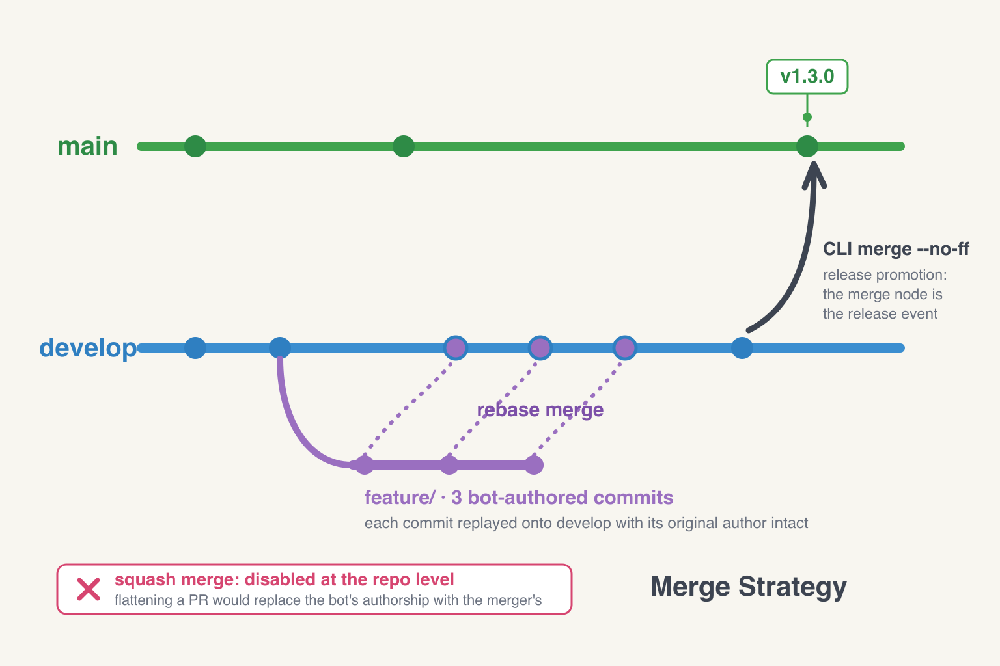

# Philosophy: Merge Strategy

**Why I rebase-merge PRs, and what that has to do with who actually wrote the code.**

This doc is the *why*. For the broader branch model it sits inside, see [Branching Strategy](./branching-strategy.md). For the bot identity model it protects, see [Claude Bot Account](../design/claude-bot-account.md).

---

## The core idea

A merge strategy isn't a UI preference — it's an authorship policy. Every merge style answers the same question differently: *after this PR lands, who does git think wrote this code?*

In a solo repo with one human author, the answer barely matters. In a repo where an AI agent (Epsilon, in my case) commits alongside the human who steered it, the answer matters a lot. Squash-merging Epsilon's commits replaces the bot's primary authorship with mine. The audit trail collapses from "who wrote the code?" to "who clicked merge?" — and the whole point of having a distinct bot identity disappears.

Rebase merge is the answer. The rest of this doc is why.

---

## 1. Authorship is data, not metadata

**Principle:** Treat every commit's `Author:` field as a real claim about who wrote the code. Preserve it through merges with the same care as the diff itself.

**Why:** `git blame` and `git log` are the source of truth for "who wrote what." If those answers are wrong, everything downstream — review attribution, audit trails, the contribution graph — is wrong too. In an AI-assisted workflow, the question "did a human or an AI write this line?" should be a `git blame` away, not a guess based on commit-message style.

This is also why every Epsilon commit sets `--author` directly rather than relying only on a `Co-Authored-By` trailer. The trailer is supplementary; the `Author:` field is canonical.

---

## 2. Default to rebase merge for PRs into `develop`

**Principle:** PRs land on `develop` via **rebase merge**. Each commit in the PR is replayed onto `develop` with its original author intact.

**Why:** Rebase preserves per-commit authorship. A 3-commit Epsilon PR puts 3 bot-authored commits on `develop`, each with me as co-author — the history is linear, blame is correct, and my contribution graph credits me three times instead of once.

The alternatives are worse:

- **Squash merge** flattens the PR into one commit authored by the merger. The bot's primary authorship is erased; the bot is demoted to a co-author trailer (and even that gets dropped silently in some merge paths). For repos where bot/human distinction matters, this is destructive.
- **Merge commit (`--no-ff`)** preserves authorship but adds a merge node authored by the merger. The graph gets bubbly; `git log --oneline` becomes harder to scan.

Rebase is the cleanest: linear history *and* preserved authorship.

---

## 3. CLI `--no-ff` for `develop → main`

**Principle:** The release promotion uses `git merge --no-ff` from the command line, not GitHub's UI.

**Why:** Covered in detail in [Branching Strategy §5](./branching-strategy.md#5-releases-preserve-commit-ancestry-cli-merge-not-ui-merge). Short version: GitHub's merge button squashes by default, which corrupts ancestry at the `develop → main` boundary and produces merge conflicts on every subsequent release. The CLI `--no-ff` preserves the graph.

Note the inversion from principle #2: for PRs, rebase wins because linearity matters and merge bubbles don't carry information. For releases, `--no-ff` wins because the merge node *is* the release event — it's the visible record of "develop was promoted to main here." The merge style should match whether the merge itself carries information.

---

## 4. Never squash in repos where authorship matters

**Principle:** Squash merge is disabled at the repo level for any repo where AI agents commit. `/setup-repo` enforces this on new repos.

**Why:** Squash isn't just lossy — it's *silently* lossy. Nothing in GitHub's UI tells you that the squash commit replaced the bot's authorship with yours, or that the `Co-Authored-By` trailers got dropped. You notice six months later when `git blame` shows your name on lines you didn't write, and by then the history is unrecoverable.

Disabling squash at the repo level (`Settings → Pull Requests → Allow squash merging: off`) is the one mechanical guarantee. "Always rebase by convention" without that guarantee just means someone clicks the wrong button eventually.

---

## 5. Linear history is the default; merge bubbles are the exception

**Principle:** Optimize for `git log --oneline` being readable. Reserve merge commits for events that genuinely need to be visible in the graph.

**Why:** Most history reading happens in linear form — `git log`, `git blame`, IDE timelines, GitHub's commits view all read better as a flat list than a tangled graph. Merge commits introduce a node that says "two branches met here" — useful when the meeting is a real event (a release promotion), useless when it's an implementation detail of how a PR landed.

The test: would a future reader looking at this merge node learn something they couldn't learn from the commits themselves? If yes, keep the merge commit. If no, rebase.

---

## What this philosophy is *not*

- **Not anti-squash universally.** Squash is fine in repos where every commit has the same author and per-commit history doesn't carry signal — single-contributor experimental projects, throwaway prototypes. The rule kicks in once authorship becomes a distinguishable signal.
- **Not anti-merge-commit.** `--no-ff` is the right tool for `develop → main` and any other ceremonial merge. The principle is matching the merge style to whether the merge node itself carries information.
- **Not a substitute for branch protection.** Rebase by convention without protection just means the wrong button eventually gets clicked. Both layers are required.

---

## Related

- [Branching Strategy](./branching-strategy.md) — the broader branch model this fits inside.
- [Claude Bot Account](../design/claude-bot-account.md) — the Epsilon identity model this protects.
- [Branching & Releases](../workflows/branching-and-releases.md) — the concrete commands.
